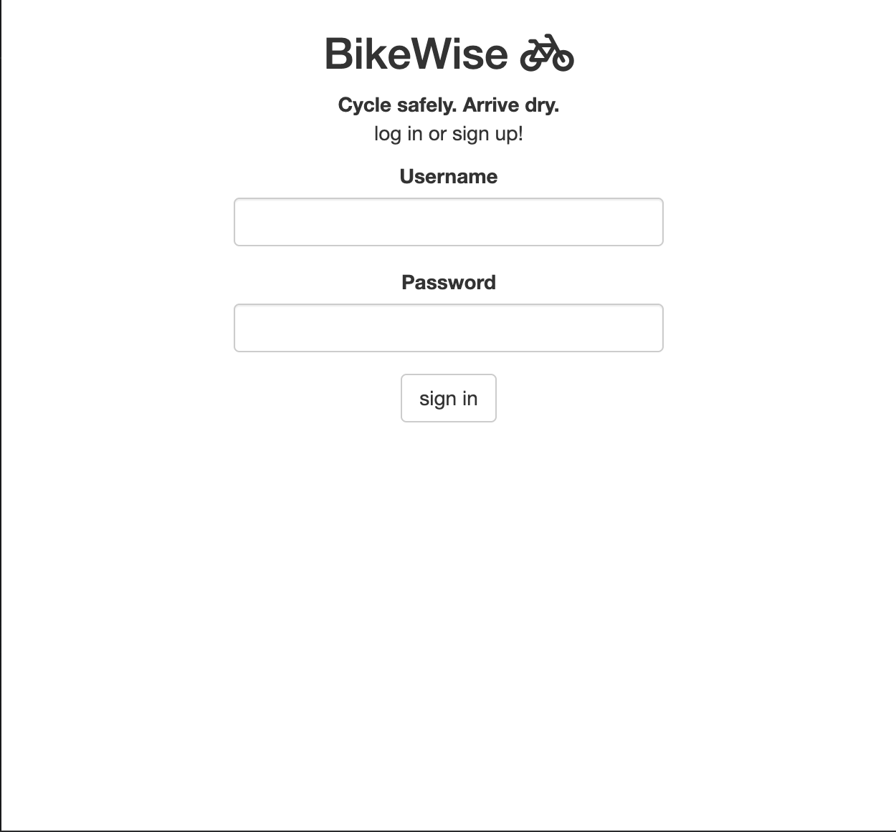
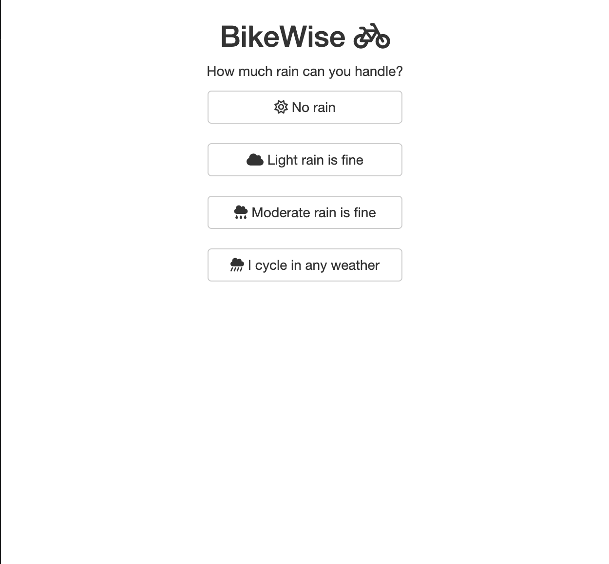
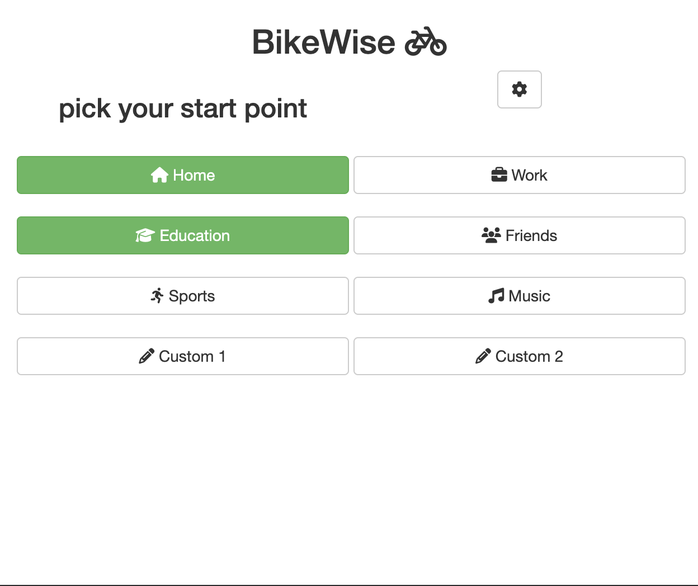
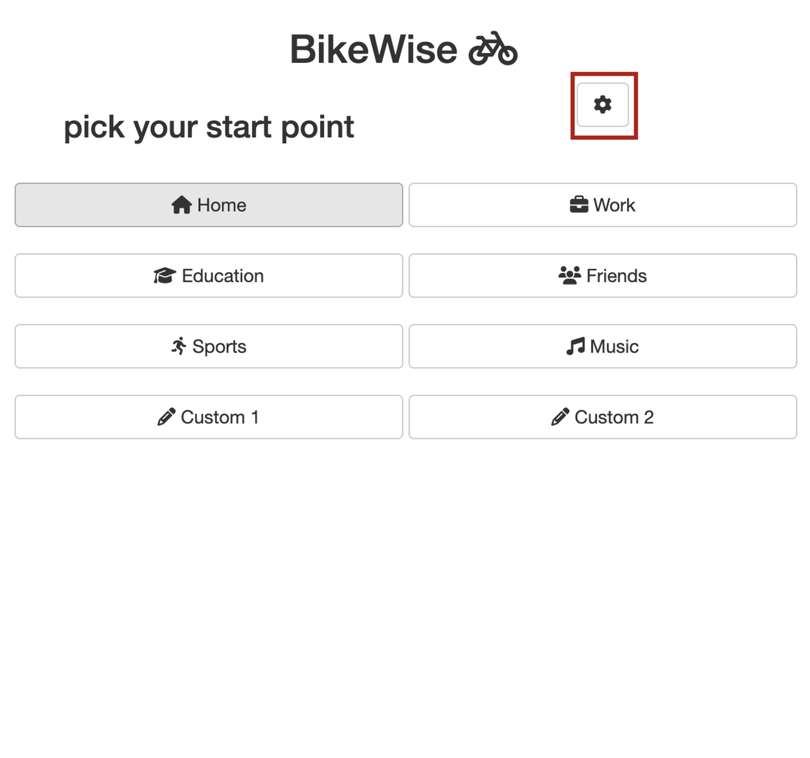
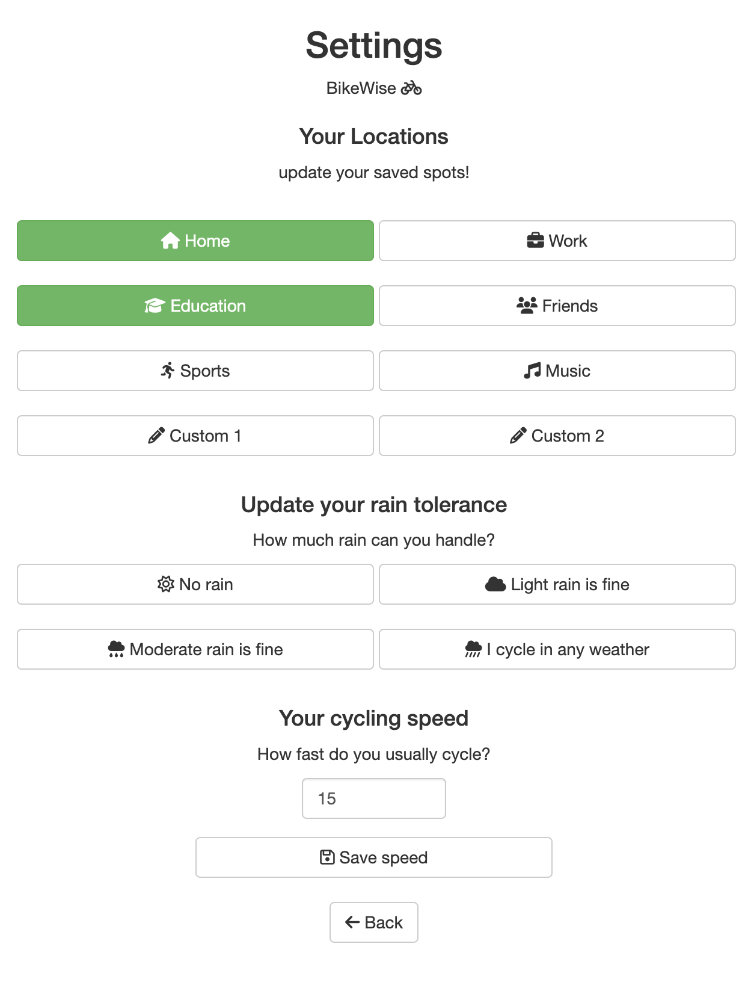
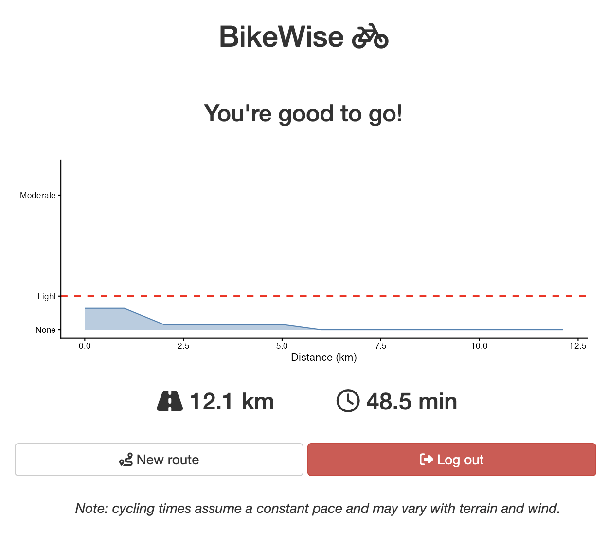

```{r setup, include = FALSE}
knitr::opts_chunk$set(collapse = TRUE, comment = "#>", fig.align = "center")
library(BikeWise)
```

---

## What is BikeWise?

BikeWise helps you decide **when to leave** for a bike ride. Standard weather
apps tell you what the rain is doing at your front door. BikeWise checks the
weather at *every point along your route*, at the *exact time you'll be there*.

The result is one clear recommendation:

| Message | What it means |
|---|---|
| **You're good to go!** | Leave now — dry the whole way |
| **Leave at HH:MM for a dry ride.** | Rain right now, but a dry window is coming |
| **No dry window today. Grab a raincoat.** | No luck in today's 24-hour forecast |
| **Built different. Just ride.** | Rain doesn't bother you — just go |

Try it instantly — no installation needed:
**[https://sebkrbs.shinyapps.io/bikewise/](https://sebkrbs.shinyapps.io/bikewise/)**

---

## Scenario

### Purpose

This scenario describes how a regular cyclist uses BikeWise to plan a commute
on a rainy Amsterdam morning — from opening the app to reading the recommendation.

### User

**Alex**, a 24-year-old psychology student at the University of Amsterdam.
Alex cycles to university most days and hates arriving soaked. They use BikeWise
from their phone via the web app.

### Equipment & assumptions

**Web app — no installation needed:**

- A modern browser (Chrome 90+, Firefox 88+, Safari 14+, Edge 90+)
- An internet connection

**R local mode (`StartCycling()`):**

- R ≥ 4.1 — download from [cran.r-project.org](https://cran.r-project.org)
- The `devtools` package to install from GitHub:

```r
install.packages("devtools")
```

- BikeWise itself:

```r
devtools::install_github("sebkrbs/BikeWise")
```

- All package dependencies are installed automatically alongside BikeWise:
  `httr2` (API calls), `ggplot2` (rain chart), `shiny` (the app interface),
  `digest` (password hashing), `openssl` (encryption), `googlesheets4`
  (online mode), `tools` (R utilities)
- An internet connection (required for route and weather data)

**R online mode (`StartCyclingOnline()`) — additional requirements:**

- A Google account and a Google Cloud service account JSON key
- Three environment variables in `~/.Renviron`:
  `BIKEWISE_SHEET_ID`, `BIKEWISE_SERVICE_ACCOUNT`, `BIKEWISE_ENCRYPTION_KEY`
- Full setup: `vignette("Online Setup", package = "BikeWise")`

### Steps

**1. Open BikeWise.**
Alex visits the web app or runs `StartCycling()` in R. A login screen with a
username field, a password field, and a "sign in" button appears.

**2. Log in.**
Alex enters a username and password and clicks "sign in". New usernames create
an account automatically — no email address or confirmation step needed. First-time
users are taken to the rain tolerance screen; returning users go straight to the
start-point screen.

**3. Set rain tolerance (first time only).**
A screen with four buttons appears — No rain, Light rain is fine, Moderate rain
is fine, I cycle in any weather. Alex picks **Moderate rain is fine** — a drizzle
is fine, heavy showers are not. This choice is saved and can be updated in Settings.

**4. Pick a start location.**
A grid of eight location buttons appears — Home, Work, Education, Friends, Sports,
Music, Custom 1, Custom 2. Green buttons have a saved address; grey ones will ask
for an address when tapped. Alex taps **Home** (green).

**5. Pick a destination.**
The same eight-button grid reappears, now labelled "pick your end point", with a
Back button to change the start if needed. Alex taps **Education**. Since the
university address was not saved yet, a text-input pop-up appears — Alex types the
address, BikeWise geocodes it via OpenStreetMap and saves it for next time.

**6. BikeWise calculates the route and checks the weather.**
A brief loading state is shown while results are fetched. The route is retrieved
from the OSRM cycling API, then weather is checked at each kilometre mark at the
exact minute Alex would be there — no input is needed from Alex at this step.

**7. Read the recommendation.**
The result screen shows one of four advice messages at the top, a rain intensity
chart (mm/h over cycling distance) with a red dashed threshold line, and the total
distance and estimated cycling time below the chart. If the message reads
*"Leave at 09:15 for a dry ride."*, Alex knows to grab a coffee first.

**8. New route or log out.**
Two buttons at the bottom of the result screen offer the next action: **New Route**
to check another journey, or **Log out** to end the session.

---

## Flowchart

```{r flowchart, echo = FALSE, fig.width = 9, fig.height = 14, out.width = "100%"}
if (requireNamespace("DiagrammeR", quietly = TRUE)) {
  DiagrammeR::grViz('
    digraph bikewise {
      rankdir = TB
      graph [fontname = Helvetica, compound = true,
             nodesep = 0.4, ranksep = 0.5, size = "8,14"]
      node  [fontname = Helvetica, fontsize = 9, shape = box,
             style = "rounded,filled", fillcolor = white, margin = "0.14,0.07"]
      edge  [fontname = Helvetica, fontsize = 8]

      // ─── USER ───────────────────────────────────────────────────
      subgraph cluster_user {
        label = "User"
        style = filled; fillcolor = "#dce8fb"; color = steelblue
        fontname = Helvetica; fontsize = 12; fontcolor = steelblue

        U1  [label = "Open app\nStartCycling()  or  web"]
        U2  [label = "Enter username & password\nclick Sign in"]
        U3  [label = "Choose rain tolerance\nnone  ·  light  ·  moderate  ·  heavy\n(first login only)"]
        U4  [label = "Click start location\n(8 buttons: Home · Work · Education\nFriends · Sports · Music · Custom 1 · Custom 2)"]
        U4b [label = "Type start address\nin pop-up"]
        U5  [label = "Click end location\n(same 8 buttons — start excluded)"]
        U5b [label = "Type end address\nin pop-up"]
        U6  [label = "View result screen\nadvice  ·  rain chart  ·  distance  ·  time"]
        U7a [label = "Tap New route"]
        U7b [label = "Tap Log out"]
      }

      // ─── SETTINGS (optional path) ────────────────────────────────
      subgraph cluster_settings {
        label = "Settings  ·  optional — reachable from start and end screens"
        style = filled; fillcolor = "#fffbe6"; color = "#b8860b"
        fontname = Helvetica; fontsize = 11

        US0  [label = "Click  ⚙  Settings button"]
        US1  [label = "Click a location button\nto edit that saved spot"]
        US1b [label = "Type new address\nin pop-up"]
        US2  [label = "Click rain tolerance button\n(none  ·  light  ·  moderate  ·  heavy)"]
        US3  [label = "Enter cycling speed (1–100 km/h)\nclick Save speed"]
        US4  [label = "Click Back\nreturns to previous screen"]
      }

      // ─── BIKEWISE ────────────────────────────────────────────────
      subgraph cluster_bw {
        label = "BikeWise"
        style = filled; fillcolor = "#fce8e6"; color = tomato
        fontname = Helvetica; fontsize = 12

        S1   [label = "authenticate_user()\nSHA-256 hash password\ncheck or create account in backend"]
        Serr [label = "Show error: wrong password\nstay on login screen",
              shape = note, fillcolor = "#ffe0e0"]
        S2   [label = "rain_tolerance()  set\nsave preference to backend"]
        S3   [label = "get_locations()\nload saved spots from backend\ndecrypt fields if online mode"]
        S4a  [label = "save_location()  — start\ngeocode via Nominatim\nwrite to backend  (encrypt if online)"]
        S4b  [label = "save_location()  — end\ngeocode via Nominatim\nwrite to backend  (encrypt if online)"]
        S5   [label = "bikeroute()\nOSRM API  →  GeoJSON route geometry\nHaversine distance per segment\ninterpolate position at each 1 km mark\nreturns: timed_coords · distance_km · duration_min"]
        S6   [label = "raintracker()\nOpen-Meteo API per checkpoint  (up to 30)\nclassify rain intensity vs tolerance threshold\niterate departure time until full route is clear\nreturns: safe_to_go · suggested_departure · route_rain_summary"]
        S7a  [label = "plot_rain()\nggplot2 area chart\nblue area = rain mm/h over distance\nred dashed line = tolerance threshold"]
        S7b  [label = "render advice message\nGood to go!\nLeave at HH:MM for a dry ride.\nNo dry window today. Grab a raincoat.\nBuilt different. Just ride."]
        S8   [label = "save_location()  — settings\ngeocode updated address via Nominatim\nwrite to backend"]
        S9   [label = "rain_tolerance()  set\nsave to backend\ninvalidate rain_result reactive\nraintracker() re-runs"]
        S10  [label = "cycling_speed()  set\nsave to backend\ninvalidate route_data reactive\nbikeroute() + raintracker() re-run"]
      }

      // ─── EXTERNAL APIs ───────────────────────────────────────────
      subgraph cluster_api {
        label = "External APIs"
        style = filled; fillcolor = "#e8f8e8"; color = seagreen
        fontname = Helvetica; fontsize = 12

        A1 [label = "Nominatim / OpenStreetMap\ngeocode address  →  lat, lon"]
        A2 [label = "OSRM Routing API\ncycling route  →  GeoJSON geometry"]
        A3 [label = "Open-Meteo API\n15-min precipitation per checkpoint\nnext 24 hours in mm/h"]
      }

      // ═══ MAIN FLOW ═══════════════════════════════════════════════

      U1  -> U2
      U2  -> S1
      S1  -> Serr [label = " wrong password",
                   color = "#cc4444", fontcolor = "#cc4444"]
      S1  -> U3   [label = " new user"]
      S1  -> S3   [label = " returning user"]
      U3  -> S2
      S2  -> S3
      S3  -> U4

      U4  -> U5   [label = " green  (saved address)"]
      U4  -> U4b  [label = " grey  (new address)"]
      U4b -> S4a
      S4a -> A1   [label = " geocode request"]
      S4a -> U5   [label = " address saved  →  pick end"]

      U5  -> S5   [label = " green  (different from start)"]
      U5  -> U5b  [label = " grey  (new address)"]
      U5  -> U4   [label = " back", constraint = false,
                   style = dashed, color = "#888888", fontcolor = "#888888"]
      U5b -> S4b
      S4b -> A1   [label = " geocode request"]
      S4b -> S5   [label = " address saved  →  calculate"]

      S5  -> A2   [label = " route request"]
      S5  -> S6
      S6  -> A3   [label = " forecast per checkpoint"]
      S6  -> S7a
      S6  -> S7b
      S7a -> U6
      S7b -> U6

      U6  -> U7a
      U6  -> U7b
      U7a -> U4   [label = " clear route  →  pick start",
                   constraint = false, style = dashed,
                   color = "#888888", fontcolor = "#888888"]
      U7b -> U1   [label = " clear session  →  login",
                   constraint = false, style = dashed,
                   color = "#888888", fontcolor = "#888888"]

      // ═══ SETTINGS PATH ═══════════════════════════════════════════

      U4  -> US0  [label = " ⚙"]
      U5  -> US0  [label = " ⚙"]

      US0 -> US1
      US0 -> US2
      US0 -> US3
      US0 -> US4

      US1  -> US1b
      US1b -> S8
      S8   -> A1  [label = " geocode request"]

      US2  -> S9
      US3  -> S10

      S9  -> S6   [label = " tolerance changed  →  rain recalculates",
                   constraint = false, style = dashed,
                   color = "#b8860b", fontcolor = "#b8860b"]
      S10 -> S5   [label = " speed changed  →  route recalculates",
                   constraint = false, style = dashed,
                   color = "#b8860b", fontcolor = "#b8860b"]

      US4 -> U4   [label = " from pick-start", constraint = false,
                   style = dashed, color = "#888888", fontcolor = "#888888"]
      US4 -> U5   [label = " from pick-end", constraint = false,
                   style = dashed, color = "#888888", fontcolor = "#888888"]
    }
  ')
}
```

**Blue** — user actions. **Red** — BikeWise processing. **Yellow** — the optional
Settings path, accessible from both location screens. **Green** — external API
calls. Solid grey edges are the main flow; dashed grey edges are navigation
loops and back-paths; dashed amber edges are reactive recalculations triggered
by a settings change. In online mode (`StartCyclingOnline()`) all backend reads
and writes go via Google Sheets using a service account; all personal data is
AES-256 encrypted before it reaches the sheet.

---

## How-to: the Shiny app

The fastest way to use BikeWise is the hosted web app:
**https://sebkrbs.shinyapps.io/bikewise/**

To run it locally from R instead:

```{r launch, eval = FALSE}
library(BikeWise)
StartCycling()   # local mode — data stored in CSV files on your machine
```

### Login

The first screen is a simple form. Enter any username and password; if the
username does not exist yet, BikeWise creates an account automatically.

```{r fig-login, echo = FALSE, out.width = "40%"}

```

### Rain tolerance (first-time only)

New users are asked once how much rain they are willing to cycle in:

| Button | Threshold | Description |
|---|---|---|
| ☀️ No rain | < 0.1 mm/h | Only leave when completely dry |
| ☁️ Light rain is fine | < 2.5 mm/h | A drizzle won't stop you |
| 🌧 Moderate rain is fine | < 10 mm/h | You're OK in moderate showers |
| ⛈ I cycle in any weather | No limit | Rain is irrelevant to you |

Your choice is saved and used for every subsequent route check. You can update
it anytime in Settings.

```{r fig-tolerance, echo = FALSE, out.width = "40%"}

```

### Picking your locations

Eight preset location buttons appear on the start and end screens.

- **Green** buttons have a saved address — tap to use immediately.
- **Grey** buttons have no address yet — tapping opens a pop-up where you type
  any address or landmark; BikeWise geocodes it via OpenStreetMap and saves it
  for next time.

BikeWise also prevents routing to the same location you departed from.

```{r fig-pick-start, echo = FALSE, out.width = "40%"}

```

### Settings

The ⚙️ cog icon in the top right of the location screens opens Settings.

```{r fig-settings-cog, echo = FALSE, out.width = "40%"}

```

From here you can:

- **Update any saved address** — tap the location button, type the new address,
  press Save
- **Change your rain tolerance** — takes effect on the next route check
- **Set your cycling speed** — enter your typical speed in km/h (default 15);
  this changes both the displayed travel time and the timing of all rain lookups

```{r fig-settings, echo = FALSE, out.width = "40%"}

```

### Result screen

Once both endpoints are selected, BikeWise fetches the route and weather and
shows the result screen with three parts:

1. **The advice** — one of the four recommendation messages at the top
2. **The rain chart** — rain intensity (mm/h) over route distance, with a red
   dashed line marking your tolerance threshold
3. **Distance and time** — total route length and estimated cycling time

```{r fig-result, echo = FALSE, out.width = "40%"}

```

Tap **New Route** to check another journey, or **Log out** to clear your session.

---

## R functions

The Shiny app is just a wrapper. All core logic is available as regular R
functions you can call from any script.

### `bikeroute()` — plan a cycling route

`bikeroute()` takes two coordinate pairs and returns the cycling route from the
OSRM API, including a timed position data frame.

```{r bikeroute-call, eval = FALSE}
route <- bikeroute(
  from_lat = 52.3559, from_lon = 4.9476,   # Science Park
  to_lat   = 52.3792, to_lon   = 4.9003,   # Amsterdam Centraal
  speed_kmh = 15                            # default; change to your own pace
)
```

The return value is a list with three elements:

```{r bikeroute-output}
# Example output — what bikeroute() returns for a 5.1 km route
example_route <- list(
  distance_km  = 5.1,
  duration_min = 20.4,
  timed_coords = data.frame(
    time_min = c( 0.00,  4.08,  8.16, 12.24, 16.33, 20.40),
    dist_km  = c( 0.0,   1.0,   2.0,  3.0,   4.0,   5.1),
    lon      = c( 4.948, 4.944, 4.938, 4.929, 4.918, 4.900),
    lat      = c(52.356, 52.360, 52.363, 52.368, 52.373, 52.379)
  )
)

example_route$distance_km
example_route$duration_min
```

```{r bikeroute-table, echo = FALSE}
knitr::kable(example_route$timed_coords, digits = 3,
             caption = "timed_coords: estimated position at each km mark")
```

`timed_coords` is the key output — it records your estimated position at each
kilometre, and `raintracker()` uses it to look up the weather at the right time
and place.

### `raintracker()` — check rain along the route

`raintracker()` takes the `timed_coords` data frame and checks the Open-Meteo
15-minute forecast at every checkpoint, then finds the earliest dry departure.

```{r raintracker-call, eval = FALSE}
result <- raintracker(
  timed_df   = route$timed_coords,
  start_time = Sys.time(),
  threshold  = "moderate"   # "none" | "light" | "moderate" | "heavy"
)
```

The return value is a list with three elements:

```{r raintracker-output}
# Example: a rainy 10:45 departure shifted to 11:15
example_result <- list(
  safe_to_go          = TRUE,
  suggested_departure = as.POSIXct("2026-05-27 11:15:00", tz = "Europe/Amsterdam"),
  route_rain_summary  = data.frame(
    time_min   = c( 0.00,  4.08,  8.16, 12.24, 16.33, 20.40),
    dist_km    = c( 0.0,   1.0,   2.0,  3.0,   4.0,   5.1),
    lon        = c( 4.948, 4.944, 4.938, 4.929, 4.918, 4.900),
    lat        = c(52.356, 52.360, 52.363, 52.368, 52.373, 52.379),
    rain_mm_h  = c( 0.00,  1.20,  2.10,  0.80,  0.30,  0.00),
    rain_level = c("none", "light", "light", "light", "none", "none")
  )
)

example_result$safe_to_go
format(example_result$suggested_departure, "%H:%M")
```

```{r raintracker-table, echo = FALSE}
knitr::kable(example_result$route_rain_summary, digits = 2,
             caption = "route_rain_summary: rain at each checkpoint at departure time")
```

When `safe_to_go` is `FALSE` and `suggested_departure` is `NA`, no dry window
was found in the next 24 hours. The `route_rain_summary` then shows conditions
at the originally requested departure time so you can see how bad it would be.

### `plot_rain()` — visualise the forecast

`plot_rain()` turns the `route_rain_summary` into a ggplot2 area chart.

Here are two side-by-side scenarios for the same route — what the chart looks
like at 10:45 (too rainy to leave) versus 11:15 (the dry window BikeWise found):

```{r plot-rain-demo, fig.width = 6.5, fig.height = 3, fig.cap = "Left: conditions at 10:45 — rain exceeds the moderate threshold around km 2. Right: conditions at 11:15 — the full route is below the threshold."}
rainy_departure <- data.frame(
  dist_km    = c(0.0, 1.0, 2.0, 3.0, 4.0, 5.1),
  rain_mm_h  = c(1.8, 5.4, 11.2, 7.6, 2.9, 0.4),
  rain_level = c("light", "moderate", "heavy", "moderate", "light", "none")
)

dry_window <- data.frame(
  dist_km    = c(0.0, 1.0, 2.0, 3.0, 4.0, 5.1),
  rain_mm_h  = c(0.0, 1.2, 2.1, 0.8, 0.3, 0.0),
  rain_level = c("none", "light", "light", "light", "none", "none")
)

p_rainy <- plot_rain(rainy_departure, tolerance = "moderate") +
  ggplot2::ggtitle("10:45 — too rainy")

p_dry <- plot_rain(dry_window, tolerance = "moderate") +
  ggplot2::ggtitle("11:15 — dry window found")

# side-by-side using base graphics layout
gridExtra::grid.arrange(p_rainy, p_dry, ncol = 2)
```

The blue area shows rain intensity (mm/h) over cycling distance. The red dashed
line is your tolerance threshold. At 10:45 the blue area punches through the
line around km 2 — BikeWise shifts the departure forward until every checkpoint
clears the threshold, landing on 11:15.

### Supporting functions

These functions are used by the app automatically, but you can also call them
directly from R.

**`authenticate_user()`** — log in or create an account. Returns one of three
values depending on what it finds:

```{r authenticate-output, echo = FALSE, comment = ""}
# Three possible return values
cat('"created"       — new username, account was just made\n')
cat('"authenticated" — existing username, password matched\n')
cat('"wrong_password"— existing username, password did not match\n')
```

```{r authenticate-call, eval = FALSE}
authenticate_user("alex", "mypassword", example = TRUE)
#> [1] "created"

authenticate_user("alex", "mypassword", example = TRUE)
#> [1] "authenticated"
```

**`save_location()`** — geocode an address and save it under a preset label.
Returns the saved coordinates:

```{r save-location-output, echo = FALSE}
# Example return value
knitr::kable(
  data.frame(lat = 52.3559, lon = 4.9476),
  caption = "save_location() return value — coordinates of the saved address"
)
```

```{r save-location-call, eval = FALSE}
save_location("alex", "education", "Science Park 904, Amsterdam", example = TRUE)
#> $lat
#> [1] 52.35589
#> $lon
#> [1] 4.94764
```

**`get_locations()`** — retrieve all saved locations for a user as a data frame:

```{r get-locations-output, echo = FALSE}
knitr::kable(
  data.frame(
    user    = c("alex", "alex"),
    label   = c("home", "education"),
    address = c("Keizersgracht 1, Amsterdam", "Science Park 904, Amsterdam"),
    lat     = c(52.3696, 52.3559),
    lon     = c(4.8837, 4.9476)
  ),
  caption = "get_locations() return value"
)
```

**`rain_tolerance()`** — get or set the rain tolerance for a user:

```{r rain-tolerance-output, echo = FALSE, comment = ""}
cat('rain_tolerance("alex", example = TRUE)          # get\n')
cat('#> [1] "moderate"\n\n')
cat('rain_tolerance("alex", "light", example = TRUE) # set\n')
cat('#> NULL (invisibly)\n')
```

**`cycling_speed()`** — get or set the cycling speed preference (km/h):

```{r cycling-speed-output, echo = FALSE, comment = ""}
cat('cycling_speed("alex", example = TRUE)            # get\n')
cat('#> [1] 20\n\n')
cat('cycling_speed("alex", speed_kmh = 25, example = TRUE) # set\n')
cat('#> NULL (invisibly)\n')
```

---

## Online mode: your own private deployment

By default `StartCycling()` stores everything in local CSV files on your machine.
If you have R on a second machine and want your saved locations and settings
in sync across both installs, you can switch to online mode backed by your
own private Google Sheet.

```{r online, eval = FALSE}
library(BikeWise)
StartCyclingOnline()
```

This mode encrypts all personal data (passwords, addresses, cycling speed,
rain tolerance) with AES-256 before writing to the sheet, so even someone with
direct access to the spreadsheet cannot read your information.

One-time setup is required — you need to:

1. Create a Google Sheet with `users` and `locations` tabs
2. Set up a Google Cloud service account so BikeWise can read and write the sheet
3. Generate an encryption key and add all three env vars to `~/.Renviron`

Full step-by-step instructions:

```{r online-vignette, eval = FALSE}
vignette("online-setup", package = "BikeWise")
```

---

## Full example

Here is a complete Science Park → Amsterdam Centraal run. The API chunks use
`eval = FALSE` since they require a live internet connection, but the plot below
uses mock data and renders directly.

```{r full-example, eval = FALSE}
library(BikeWise)

# Step 1: get the route
route <- bikeroute(
  from_lat = 52.3559, from_lon = 4.9476,
  to_lat   = 52.3792, to_lon   = 4.9003
)
cat("Distance:", route$distance_km, "km\n")
cat("Est. time:", route$duration_min, "min at 15 km/h\n")

# Step 2: check the rain with a moderate tolerance
result <- raintracker(
  timed_df   = route$timed_coords,
  start_time = Sys.time(),
  threshold  = "moderate"
)

# Step 3: read the recommendation
if (!is.na(result$suggested_departure)) {
  cat("Leave at:", format(result$suggested_departure, "%H:%M"),
      "for a dry ride.\n")
} else {
  cat("No dry window today — bring a raincoat.\n")
}

# Step 4: visualise
plot_rain(result$route_rain_summary, tolerance = "moderate")
```

**Example output on a rainy Tuesday morning:**

```
Distance: 5.1 km
Est. time: 20.4 min at 15 km/h
Leave at: 11:15 for a dry ride.
```

The rain chart for that suggested 11:15 departure would look like this:

```{r full-example-plot, fig.width = 5, fig.height = 3, fig.cap = "Rain forecast for the Science Park → Centraal route at the suggested 11:15 departure. All checkpoints clear the moderate threshold (red dashed line)."}
plot_rain(
  data.frame(
    dist_km    = c(0.0, 1.0, 2.0, 3.0, 4.0, 5.1),
    rain_mm_h  = c(0.0, 1.2, 2.1, 0.8, 0.3, 0.0),
    rain_level = c("none", "light", "light", "light", "none", "none")
  ),
  tolerance = "moderate"
)
```

Every checkpoint sits below the moderate threshold (red dashed line at 2.5 mm/h
— the boundary between light and moderate rain) — confirming BikeWise found a
genuinely dry window.

---

## APIs

BikeWise relies on three free, key-free APIs:

| API | What it does |
|---|---|
| [Open-Meteo](https://open-meteo.com) | 15-min precipitation forecasts, 24-hour window |
| [OSRM](https://project-osrm.org) | Bike-optimised route geometry and distance |
| [Nominatim](https://nominatim.org) | Address → latitude/longitude (geocoding) |

An internet connection is required. BikeWise makes at most ~33 API requests per
route check (one per checkpoint) and stays well within all public rate limits.
