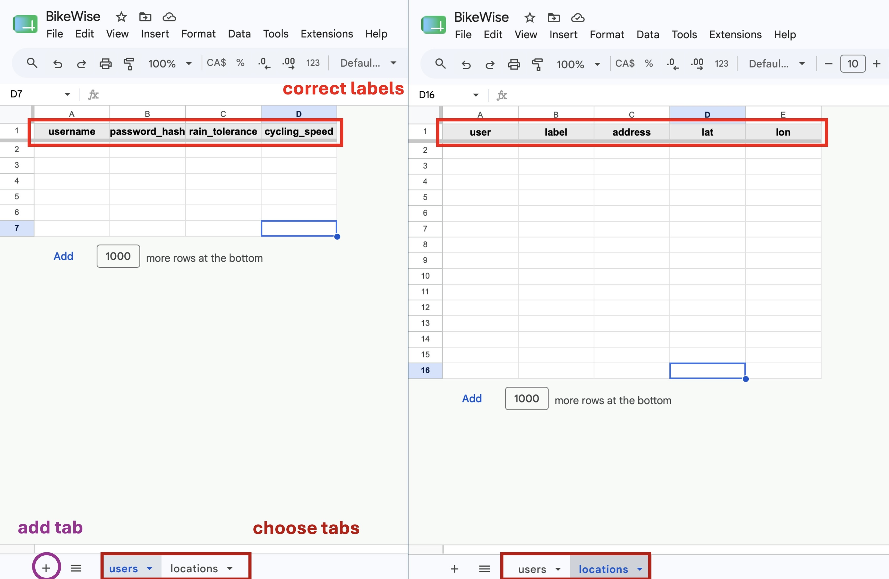
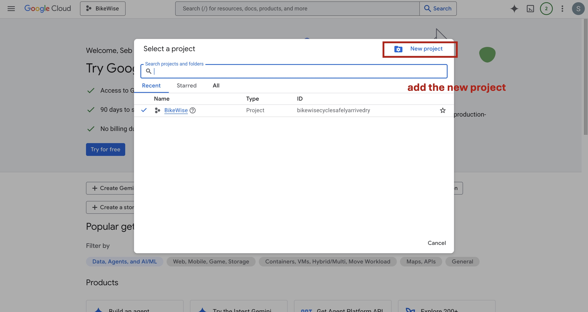
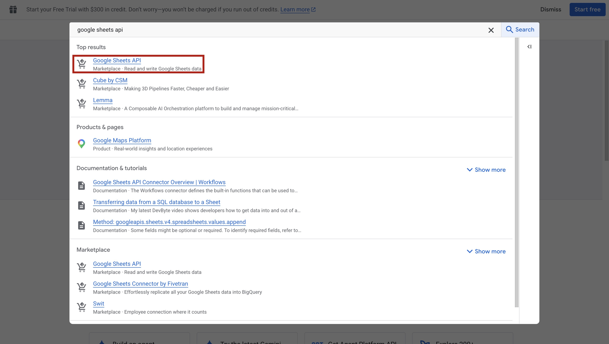
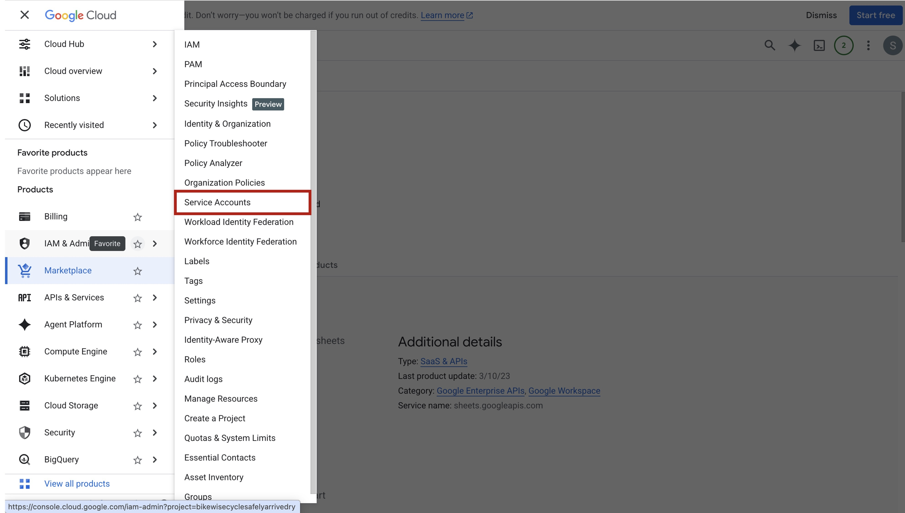
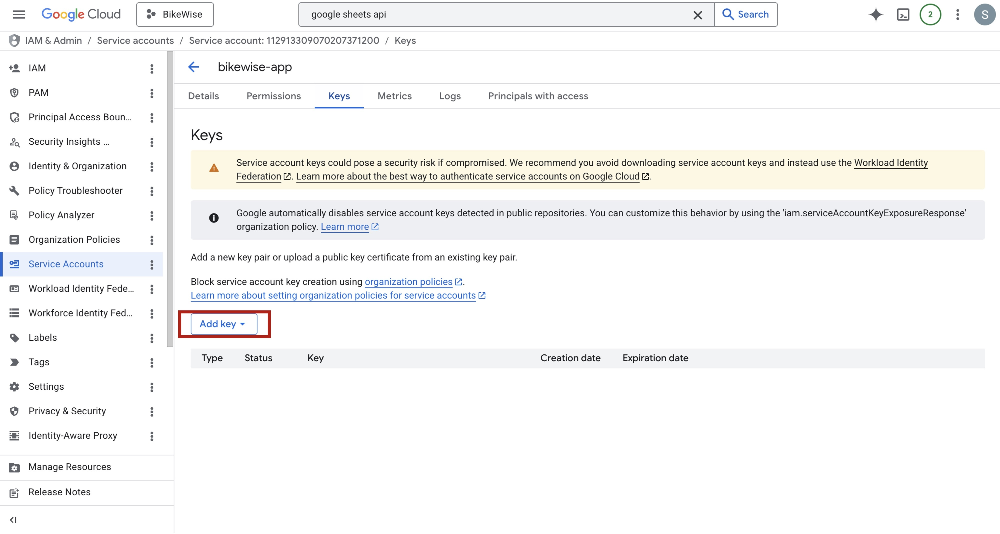

```{r setup, include = FALSE}
knitr::opts_chunk$set(collapse = TRUE, comment = "#>", fig.align = "center")
```

---

## Overview

BikeWise has two modes:

- **Local** (`StartCycling()`): data is stored in CSV files on your machine.
  Works immediately — no setup needed.
- **Online** (`StartCyclingOnline()`): data is stored in a Google Sheet that
  only you control. All sensitive data (passwords, addresses, cycling speed,
  rain tolerance) is encrypted with AES-256 before it ever reaches the sheet,
  so even someone with direct access to the spreadsheet cannot read your
  information. If you also set up the same environment variables on a second
  machine (e.g. a work laptop), both installs will read from and write to the
  same sheet — keeping your saved locations and preferences in sync.

This vignette walks through the three one-time steps to get the online mode
running.

---

## What you will need

Three environment variables in your `~/.Renviron` file:

| Variable | What it is |
|---|---|
| `BIKEWISE_SHEET_ID` | The ID of your Google Sheet |
| `BIKEWISE_SERVICE_ACCOUNT` | Path to a service account JSON key file |
| `BIKEWISE_ENCRYPTION_KEY` | A secret string used to encrypt your data |

Open `.Renviron` for editing with:

```r
usethis::edit_r_environ()
```

---

## Step 1 — Create your Google Sheet

1. Go to [sheets.google.com](https://sheets.google.com) and create a new
   blank spreadsheet.

2. Create two tabs named **exactly** `users` and `locations` (case-sensitive —
   lowercase, no spaces).

```{r fig-sheet-tabs, echo = FALSE, out.width = "60%"}

```

3. In the `users` tab, add these column headers in row 1:

   ```
   username   password_hash   rain_tolerance   cycling_speed
   ```

4. In the `locations` tab, add these column headers in row 1:

   ```
   user   label   address   lat   lon
   ```

5. Copy the sheet ID from the browser URL bar —
   `docs.google.com/spreadsheets/d/`**`THIS_PART`**`/edit`.

6. Add to `.Renviron`:

   ```
   BIKEWISE_SHEET_ID=paste-your-id-here
   ```

---

## Step 2 — Create a service account

A service account is a separate Google "robot" account that the app uses to
read and write your sheet without needing your personal Google login. It only
has access to sheets you explicitly share with it — not to your personal Google
Drive.

1. Go to [console.cloud.google.com](https://console.cloud.google.com) and sign
   in with your Google account.

2. Click the project dropdown at the top and select **New Project**. Give it a
   name (e.g. `BikeWise`) and click **Create**.

```{r fig-gcp-project, echo = FALSE, out.width = "70%"}

```

3. In the search bar at the top, type `Google Sheets API` and click **Enable**.

```{r fig-gcp-api, echo = FALSE, out.width = "70%"}

```

4. In the left sidebar go to **IAM & Admin → Service Accounts**. Click
   **+ Create Service Account**, give it a name (e.g. `bikewise-app`), and
   click **Done**.

```{r fig-service-account, echo = FALSE, out.width = "70%"}

```

5. Click the service account you just created, open the **Keys** tab, click
   **Add Key → Create new key**, choose **JSON**, and click **Create**. A
   `.json` file will download to your computer.

   > **Important:** Never commit this file to git. Add `*.json` to your
   > `.gitignore` to be safe.

```{r fig-json-key, echo = FALSE, out.width = "70%"}

```

6. Open your Google Sheet, click **Share** (top right), and paste in the
   service account email address. It looks like
   `bikewise-app@your-project.iam.gserviceaccount.com` — you can find it on
   the service accounts page in the Google Cloud Console. Give it **Editor**
   access and click **Send**.

7. Add to `.Renviron`:

   ```
   BIKEWISE_SERVICE_ACCOUNT=/path/to/downloaded-key.json
   ```

---

## Step 3 — Set an encryption key

Generate a random 32-character key by running this in R:

```r
paste(sample(c(letters, LETTERS, 0:9), 32, replace = TRUE), collapse = "")
```

Copy the output and add it to `.Renviron`:

```
BIKEWISE_ENCRYPTION_KEY=your-random-key-here
```

Save `.Renviron` and restart R (`Ctrl/Cmd + Shift + F10` in RStudio, or
`q()` and reopen).

---

## Running the app

Once all three variables are set:

```r
library(BikeWise)
StartCyclingOnline()
```

BikeWise verifies all three env vars are present, authenticates with Google
Sheets using the service account, and opens the app in your browser.
